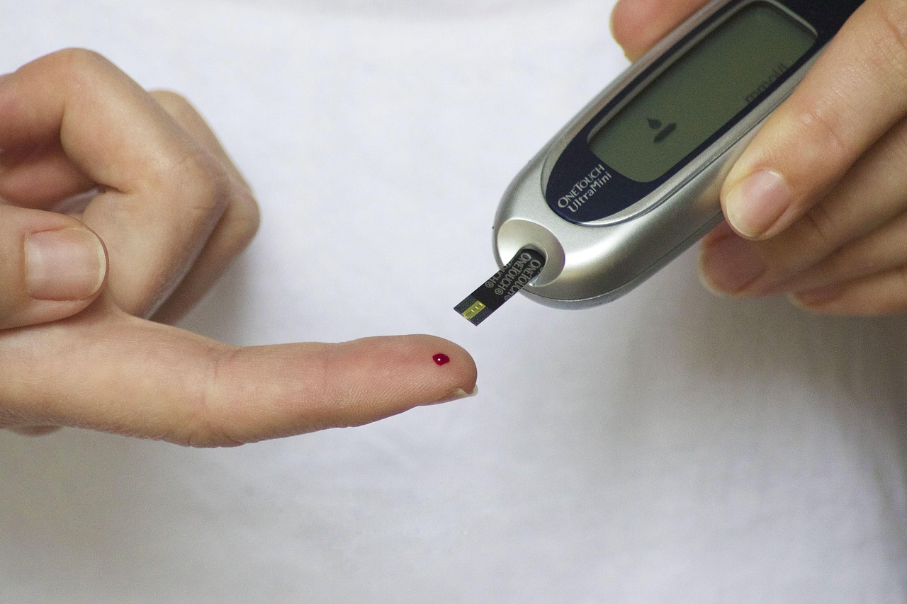

# Introduccion

La diabetes es una de las enfermedades crónicas más prevalentes en el mundo actual. Se caracteriza por niveles elevados de glucosa en la sangre debido a una deficiencia en la producción o en la acción de la insulina. En las últimas décadas, su incidencia ha aumentado de manera significativa, convirtiéndose en un problema global de salud pública que afecta a millones de personas en todas las edades y contextos sociales. Diversos factores influyen en el desarrollo de la diabetes, entre ellos los hábitos de vida como la alimentación, la actividad física y el peso corporal, este treabajo se enfocara en analizar estos factores con el objetivo de conozer la influencia que tiene cada uno en la probabilidad de desarrollar diabetes.



# Visualización de los datos 


## ¿Tiene o no efecto en la probabilidad de tener diabetes tener familia con diabetes diagnosticada? ####

```{r}
library(readr)
df <- read.csv("Diabetes_and_LifeStyle_Dataset .csv")

df$diagnosed_diabetes <- as.numeric(df$diagnosed_diabetes)
df$family_history_diabetes <- as.numeric(df$family_history_diabetes)

t_result <- t.test(diagnosed_diabetes ~ family_history_diabetes, data = df)
t_result
```
Como se puede ver, la grafica se divide en dos bloques. El bloque sobre el 0 no tiene familia con historial de diabetes y el bloque sobre el 1 si. Si miramos la proporcion de gente con diabetes diagnosticada y la gente en el bloque, se ve claramente que tener una familia con historial de diabetes hace que tu tengas mas probabilidad de desarrollar diabetes. 

Con un prop.test podremos determinar si hay una correlacion entre tener diabetes teninedo familia con diabetes de manera matematica: (Hemos elegido hacer un prop.test porque es un modelo que sigue una distribucion binomial y al tener valores binarion nos ha parecido mas adecuado)

Ho: La probabilidad de tener diabetes es independiente de tu genetica.

H1: Tener familia con diabetes aumenta la probabilidad de tener diabetes.

```{r}
library(readr)
library(ggplot2)
df <- read.csv("Diabetes_and_LifeStyle_Dataset .csv")

df$family_history_diabetes <- as.factor(df$family_history_diabetes)
df$diagnosed_diabetes <- as.factor(df$diagnosed_diabetes)

ggplot(df, aes(x = diagnosed_diabetes, fill = family_history_diabetes)) +
  geom_bar(position = "dodge") +
  labs(
    title = "Diabetes Diagnosticada por el historial familiar",
    x = "Historial de diabetes Familiar",
    y = "Número de personas",
    fill = "Diabetes Diagnosticada"
  ) +
  theme_minimal() +
  scale_fill_manual(
    values = c('0'="#56B4E9",'1' = "#E69F00")
    )


```
**Conclusiones:**

Como podemos ver por el resultado del prop.test tenemos datos que son estadisticamente significativos como para rechazar la hipotesis nula.

Como consequencia, se ve que efectivamente hay una correlacion entre tener familia con historial de diabetes y la probabilidad que tiene un sujeto en tener diabetes.

## Cuál es la distribución de la población según su estado de diabetes y como se relacionan con la edad y género ####

Ahora en este análisis lo que queremos estudiar y conocer es la distribución de los tipos de diabetes según el género de las personas que están en la muestra.

De esta manera podremos identificar:

  1.- El tipo de diabetes más común en la muestra.
  
  2.- ¿Existen diferencias significativas entre hombres y mujeres?.
  
  3.- ¿Cómo se distribuyen hombres y mujeres en cada tipo de diabetes?.

```{r}
library(readr)
data <- read.csv("Diabetes_and_LifeStyle_Dataset .csv")
ggplot(data, aes(x = diabetes_stage, fill = gender)) +
  geom_bar(position = "dodge", alpha = 0.8) +
  labs(title = "Distribución de Etapas de Diabetes por Género",
       subtitle = paste("Total de pacientes:", nrow(data)),
       x = "Etapa/ Tipo de Diabetes", 
       y = "Número de Pacientes",
       fill = "Género",
       caption = "Fuente: Dataset de Diabetes y Estilo de Vida") +
  scale_fill_manual(values = c("Female" = "#E69F00", "Male" = "#56B4E9", "Other" = "#009E73")) +
  theme_minimal() +
  theme(axis.text.x = element_text(angle = 45, hjust = 1)) +
  geom_text(stat = 'count', aes(label = ..count..), 
            position = position_dodge(0.9), vjust = -0.3, size = 3)

```

Conclusiones:

De esta gráfica podemos percatarnos de varias cosas. A primera vista nos damos cuenta de que el tipo de diabetes más común(en la muestra) el tipo 2. Qué esto por otros estudios sabemos que es verdad. Es el tipo de diabetes más común en el mundo. Por otro lado se puede ver que en la muestra, las mujeres cuantan con más casos de diabetes(del tipo que sea) que los hombres. Esto podría deberse a cuestiones hormonales o biológicas. En resumen.

  1.- La diabetes tipo 2 es la más común en la muestra.
  
  2.- Las mujeres cuentan con más casos acumulados y particulares(refiriendose   a cada tipo de diabetes) que los hombres.
  
  3.- La diabetes gestacional sigue el patrón esperado, porque esta totalmente    dominado por las mujeres que coincide con su naturaleza biológica.
  
  4.- Hay un grupo grande en estado de Pre-Diabetes, esto indica un riesgo       grande en un grupo también grande, el cuál podría beneficiarse de cuidados     preventivos para evitar padecer está enfermedad.


# Estudio para predecir la Diabetes ####

Nuestro propósito en esta sección es analizar en profundidad los distintos factores que pueden influir en el desarrollo de la diabetes. Somos conscientes de que no es algo que dependa de una sola cosa, sino de una combinación de aspectos genéticos, físicos y relacionados con el estilo de vida. Al identificar y medir el impacto de cada una de estas variables, queremos crear un modelo que nos permita predecir, con un margen de certeza significativo, las probabilidades individuales de que una persona llegue a padecer esta condición. Se trata, en esencia, de usar la información para anticiparnos.

## Relación entre los minutos de actividad física y los que están diagnosticados ####

```{r}
library(readr)
library(ggplot2)
library(scales)

# 1. Datos

data <- read.csv("Diabetes_and_LifeStyle_Dataset .csv")

# Asegurar que las variables sean numéricas
data$diagnosed_diabetes <- as.numeric(data$diagnosed_diabetes)
data$physical_activity_minutes_per_week <- as.numeric(data$physical_activity_minutes_per_week)
data$bmi <- as.numeric(data$bmi)

data_subset <- data[, c(
  "diagnosed_diabetes",
  "physical_activity_minutes_per_week",
  "bmi"
)]

# 2. Modelo simple

modelo_simple <- lm(
  diagnosed_diabetes ~ physical_activity_minutes_per_week + bmi,
  data = data_subset
)

# Predicciones individuales
data_subset$prob_fit <- predict(modelo_simple, type = "response")

# 3. Grid

activity_seq <- seq(
  min(data_subset$physical_activity_minutes_per_week, na.rm = TRUE),
  max(data_subset$physical_activity_minutes_per_week, na.rm = TRUE),
  length.out = 300
)

pred_line <- data.frame(
  physical_activity_minutes_per_week = activity_seq,
  bmi = mean(data_subset$bmi, na.rm = TRUE)
)

pred_line$prob_fit <- predict(modelo_simple, newdata = pred_line)

# 4. Gráfico 

ggplot() +
  
  geom_point(
    data = data_subset,
    aes(
      x = physical_activity_minutes_per_week,
      y = diagnosed_diabetes
    ),
    alpha = 0.15,
    size = 1.5
  ) +
  
  geom_line(
    data = pred_line,
    aes(
      x = physical_activity_minutes_per_week,
      y = prob_fit
    ),
    size = 1.6,
    color = "#0073C2"
  ) +
  
  labs(
    title = "Probabilidad Estimada de Diabetes según Minutos de Ejercicio Semanal",
    x = "Minutos de actividad física por semana",
    y = "Diagnóstico / Probabilidad estimada"
  ) +
  
  theme_minimal(base_size = 14) +
  theme(
    panel.grid.minor = element_blank(),
    panel.grid.major = element_line(colour = alpha("grey70", 0.4))
  ) +
  
  scale_y_continuous(limits = c(0, 1))
  

```

Aquí podemos observar que sí hay una relación entre el tiempo de ejercicio a la semana y las personas que tienen diabetes, podemos observar que hay más probabilidad de tener diabetes si se hace  poca cantidad de ejercicio, lo único es que los puntos únicamente se encuentran en 1 y 0 porque no tenemos puntos intermedios entre quienes tienen o no diabetes. Pero más tarde intentaremos con otras variables ver en que fase(más o menos cerca de contraer diabetes) se encuentran las personas.


## Minutos de actividad física e historial familiar ####

Ahora veremos como afecta que una persona pueda contraer diabetes dependiendo de si ha tenido hitorial familiar y el tiempo que hace deporte a la semana, a priori lo que nosotros y la mayoría de personas pensamos es que ambas son significativas e influyen mucho en la persona.
```{r}
library(readr)
library(ggplot2)
library(scales)

# 1. Cargar y preparar datos
data <- read.csv("Diabetes_and_LifeStyle_Dataset .csv")

# Asegurar que las variables sean numéricas
data$diagnosed_diabetes <- as.numeric(data$diagnosed_diabetes)
data$physical_activity_minutes_per_week <- as.numeric(data$physical_activity_minutes_per_week)
data$family_history_diabetes <- as.numeric(data$family_history_diabetes)

data_subset <- data[, c(
  "diagnosed_diabetes",
  "physical_activity_minutes_per_week",
  "family_history_diabetes"
)]

# 2. Modelo de regresión lineal múltiple
modelo_multiple <- lm(
  diagnosed_diabetes ~ physical_activity_minutes_per_week + family_history_diabetes,
  data = data_subset
)

# Predicciones individuales
data_subset$prob_fit <- predict(modelo_multiple, type = "response")

# 3. Grid con intervalos de confianza para la media
activity_seq <- seq(
  min(data_subset$physical_activity_minutes_per_week, na.rm = TRUE),
  max(data_subset$physical_activity_minutes_per_week, na.rm = TRUE),
  length.out = 300
)

# Crear grid para ambos escenarios
pred_line_sin_historial <- data.frame(
  physical_activity_minutes_per_week = activity_seq,
  family_history_diabetes = 0,
  grupo = "Sin historial familiar"
)

pred_line_con_historial <- data.frame(
  physical_activity_minutes_per_week = activity_seq,
  family_history_diabetes = 1,
  grupo = "Con historial familiar"
)

# Calcular predicciones e intervalos de confianza para la media
pred_sin_historial <- predict(modelo_multiple, newdata = pred_line_sin_historial, 
                              interval = "confidence", level = 0.95)
pred_con_historial <- predict(modelo_multiple, newdata = pred_line_con_historial, 
                              interval = "confidence", level = 0.95)

# Añadir predicciones e intervalos a los dataframes
pred_line_sin_historial$prob_fit <- pred_sin_historial[, "fit"]
pred_line_sin_historial$lwr <- pred_sin_historial[, "lwr"]
pred_line_sin_historial$upr <- pred_sin_historial[, "upr"]

pred_line_con_historial$prob_fit <- pred_con_historial[, "fit"]
pred_line_con_historial$lwr <- pred_con_historial[, "lwr"]
pred_line_con_historial$upr <- pred_con_historial[, "upr"]

# Combinar ambos dataframes para ggplot
pred_line_combined <- rbind(pred_line_sin_historial, pred_line_con_historial)

# 4. Gráfico con intervalos de confianza para la media - CORREGIDO
ggplot() +
  geom_point(
    data = data_subset,
    aes(
      x = physical_activity_minutes_per_week,
      y = diagnosed_diabetes
    ),
    alpha = 0.1,
    size = 1.5,
    color = "gray50"
  ) +
  
  # Intervalos de confianza para la media (áreas sombreadas)
  geom_ribbon(
    data = pred_line_combined,
    aes(
      x = physical_activity_minutes_per_week,
      ymin = lwr,
      ymax = upr,
      fill = grupo
    ),
    alpha = 0.3
  ) +
  
  # Líneas de predicción (media)
  geom_line(
    data = pred_line_combined,
    aes(
      x = physical_activity_minutes_per_week,
      y = prob_fit,
      color = grupo
    ),
    size = 1.5
  ) +
  
  # Escalas y colores mejorados
  scale_color_manual(
    name = "Historial familiar",
    values = c("Sin historial familiar" = "#0073C2", 
               "Con historial familiar" = "#FF6B6B")
  ) +
  
  scale_fill_manual(
    name = "Historial familiar",
    values = c("Sin historial familiar" = "#0073C2", 
               "Con historial familiar" = "#FF6B6B")
  ) +
  
  labs(
    title = "Probabilidad Estimada de Diabetes según Minutos de Ejercicio Semanal",
    subtitle = "Líneas sólidas: probabilidad media predicha | Áreas sombreadas: intervalos de confianza del 95% para la media",
    x = "Minutos de actividad física por semana",
    y = "Probabilidad estimada de diabetes"
  ) +
  
  theme_minimal(base_size = 14) +
  theme(
    plot.title = element_text(
      size = 16,
      face = "bold",
      hjust = 0.5,
      margin = margin(b = 10)
    ),
    plot.subtitle = element_text(
      size = 12,
      color = "gray40",
      hjust = 0.5,
      margin = margin(b = 15)
    ),
    panel.grid.minor = element_blank(),
    panel.grid.major = element_line(color = alpha("grey80", 0.6)),
    axis.title = element_text(face = "bold"),
    legend.position = "top",
    legend.title = element_text(face = "bold", size = 12),
    legend.text = element_text(size = 11),
    plot.margin = margin(20, 20, 20, 20)
  ) +
  
  scale_y_continuous(
    limits = c(0, 1),
    labels = percent_format(accuracy = 1),
    breaks = seq(0, 1, by = 0.2)
  ) +
  
  scale_x_continuous(
    labels = comma_format()
  )

# 5. Variables para análisis
coef_intercept <- round(coef(modelo_multiple)[1], 4)
coef_actividad <- round(coef(modelo_multiple)[2], 4)
coef_historial <- round(coef(modelo_multiple)[3], 4)

conf_int <- confint(modelo_multiple, level = 0.95)

aumento_historial <- round(coef_historial * 100, 2)
cambio_actividad <- round(coef_actividad * 100, 4)

prob_con_historial <- round(mean(data_subset$prob_fit[data_subset$family_history_diabetes == 1], na.rm = TRUE), 3)
prob_sin_historial <- round(mean(data_subset$prob_fit[data_subset$family_history_diabetes == 0], na.rm = TRUE), 3)

r_cuadrado <- round(summary(modelo_multiple)$r.squared, 4)
r_cuadrado_ajustado <- round(summary(modelo_multiple)$adj.r.squared, 4)

avg_ci_width_sin <- round(mean(pred_line_sin_historial$upr - pred_line_sin_historial$lwr), 4)
avg_ci_width_con <- round(mean(pred_line_con_historial$upr - pred_line_con_historial$lwr), 4)
```
**Analisis general:**

  Tener historial familiar de diabetes aumenta el riesgo en 23.5%

  Personas sin historial familiar: riesgo promedio de 54.8%

  Personas con historial familiar: riesgo promedio de 78.4%

  Esto significa que el historial familiar casi duplica el riesgo base

**Sobre la actividad física:**

  Por cada minuto adicional de ejercicio semanal, el riesgo de diabetes disminuye en 0.057%

  Aunque esta reducción parece pequeña por minuto, acumula un efecto significativo:

  30 minutos extra semanales: reduce riesgo en 1.7%

  60 minutos extra semanales: reduce riesgo en 3.4%

  120 minutos extra semanales: reduce riesgo en 6.8%

El modelo explica el 4.93% de la variabilidad en los casos de diabetes, lo que indica que aunque el historial familiar y el ejercicio son factores importantes, existen otros elementos no considerados en este análisis que también influyen significativamente en el desarrollo de la enfermedad.

**Conclusión Práctica:**
El historial familiar es el factor de riesgo más fuerte identificado, mientras que la actividad física regular ofrece una protección moderada pero acumulativa contra la diabetes.Entonces nos hemos dado cuenta de que lo que pensabamos no estaba del todo bien, solo hemos acertado en cuanto al historial familiar.


## Modelo para predecir la diabetes ####
Los marcadores glucémicos son una medida de la rapidez con la que un alimento con carbohidratos aumenta los niveles de azúcar(glucosa) en la sangre después de su consumo.

La **hemoglobina glucosada(HbA1c)** es una medida que mide el porcentaje de hemoglobina en los glóbulos rojos qué está unida al azúcar.
La información que nos proporciona es el nivel promedio de glucosa en la sangre durante los últimos 2-3 meses. 

La **glucosa en ayunas (GA)** mide el nivel de glucosa en la sangre después de un ayuno de al menos 8 horas.
Nos porporciona un nivel de glucosa en sangre en un momento específico, reflejando el control glúcemico después de un periodo de no ingesta.

La **glucosa postprandial (GPP)** mide el nivel de glucosa en la sangre después de una comida, generalmente se mide 2 horas después de haber comido.
Nos indica como el cuerpo gestiona el azúcar después de la ingesta de alimentos y como responde el páncreas liberando insulina.

Ahora veremos de estas tres cuál es la mejor para ver cual tiene una relación mayor y nos sirve para predescir mejor la diabetes.

```{r}
library(readr)
library(ggplot2)
library(scales)
library(dplyr)
library(tidyr)

data <- read.csv("Diabetes_and_LifeStyle_Dataset .csv")

# Asegurar variables numéricas
data <- data %>% mutate(
  diagnosed_diabetes = as.numeric(diagnosed_diabetes),
  hba1c = as.numeric(hba1c),
  glucose_fasting = as.numeric(glucose_fasting),
  glucose_postprandial = as.numeric(glucose_postprandial),
  family_history_diabetes = as.numeric(family_history_diabetes)
)

# Crear subset con solo las columnas relevantes
data_subset <- data %>%
  select(diagnosed_diabetes, hba1c, glucose_fasting, glucose_postprandial, family_history_diabetes) %>%
  na.omit()


data_long <- data_subset %>%
  pivot_longer(
    cols = c(hba1c, glucose_fasting, glucose_postprandial),
    names_to = "variable",
    values_to = "valor"
  ) %>%
  mutate(
    variable = recode(variable,
                      "hba1c" = "HbA1c (%)",
                      "glucose_fasting" = "Glucosa en Ayunas (mg/dL)",
                      "glucose_postprandial" = "Glucosa Postprandial (mg/dL)"
    ),
    grupo = ifelse(family_history_diabetes == 1,
                   "Con historial familiar", "Sin historial familiar")
  )


hba1c_seq <- seq(min(data_subset$hba1c), max(data_subset$hba1c), length.out = 200)
ayunas_seq <- seq(min(data_subset$glucose_fasting), max(data_subset$glucose_fasting), length.out = 200)
post_seq <- seq(min(data_subset$glucose_postprandial), max(data_subset$glucose_postprandial), length.out = 200)


modelo_hba1c  <- lm(diagnosed_diabetes ~ hba1c + family_history_diabetes, data = data_subset)
modelo_ayunas <- lm(diagnosed_diabetes ~ glucose_fasting + family_history_diabetes, data = data_subset)
modelo_post   <- lm(diagnosed_diabetes ~ glucose_postprandial + family_history_diabetes, data = data_subset)


make_pred <- function(seq, var_name, modelo, var_label){
  
  df <- expand.grid(
    valor = seq,
    family_history_diabetes = c(0, 1)
  )
  
  names(df)[1] <- var_name
  
  preds <- predict(modelo, newdata = df, interval = "confidence")
  
  df$fit  <- preds[, "fit"]
  df$lwr  <- preds[, "lwr"]
  df$upr  <- preds[, "upr"]
  
  df$variable <- var_label
  df$grupo    <- ifelse(df$family_history_diabetes == 1,
                        "Con historial familiar", "Sin historial familiar")
  
  # Devolver con columna genérica "valor"
  names(df)[1] <- "valor"
  df
}


pred_combined <- bind_rows(
  make_pred(hba1c_seq, "hba1c", modelo_hba1c, "HbA1c (%)"),
  make_pred(ayunas_seq, "glucose_fasting", modelo_ayunas, "Glucosa en Ayunas (mg/dL)"),
  make_pred(post_seq, "glucose_postprandial", modelo_post, "Glucosa Postprandial (mg/dL)")
)

grafico <- ggplot() +
  
  geom_point(
    data = data_long,
    aes(x = valor, y = diagnosed_diabetes),
    alpha = 0.05, size = 1, color = "gray50"
  ) +
  
  geom_ribbon(
    data = pred_combined,
    aes(x = valor, ymin = lwr, ymax = upr, fill = grupo),
    alpha = 0.25
  ) +
  
  geom_line(
    data = pred_combined,
    aes(x = valor, y = fit, color = grupo),
    linewidth = 1.3
  ) +
  
  facet_wrap(~ variable, scales = "free_x", ncol = 3) +
  scale_color_manual(
    name = "Historial familiar:",
    values = c(
      "Sin historial familiar" = "#0066CC",
      "Con historial familiar" = "#CC0033"
    )
  ) +
  scale_fill_manual(
    name = "Historial familiar:",
    values = c(
      "Sin historial familiar" = "#66B2FF",
      "Con historial familiar" = "#FF99A6"
    )
  ) +
  
  scale_y_continuous(
    limits = c(0, 1),
    labels = percent_format(accuracy = 1),
    breaks = seq(0, 1, 0.2)
  ) +
  
  labs(
    title = "Marcadores glucémicos y probabilidad estimada",
    subtitle = "Modelos lineales",
    x = "Valor del marcador",
    y = "Probabilidad estimada"
  ) +
  
  theme_minimal(base_size = 15) +
  theme(
    plot.title = element_text(size = 18, face = "bold", hjust = 0.5),
    plot.subtitle = element_text(size = 13, color = "gray40", hjust = 0.5),
    legend.position = "top",
    legend.title = element_text(face = "bold"),
    strip.text = element_text(face = "bold", size = 12),
    panel.grid.minor = element_blank(),
    panel.grid.major = element_line(color = alpha("grey80", 0.6)),
    plot.margin = margin(20, 20, 20, 20)
  )

grafico

# 8. modelos
comparacion <- data.frame(
  Variable = c("HbA1c (%)", "Glucosa Ayunas", "Glucosa Postprandial"),
  R2 = c(
    summary(modelo_hba1c)$r.squared,
    summary(modelo_ayunas)$r.squared,
    summary(modelo_post)$r.squared
  ),
  Coef_Variable = c(
    coef(modelo_hba1c)["hba1c"],
    coef(modelo_ayunas)["glucose_fasting"],
    coef(modelo_post)["glucose_postprandial"]
  ),
  Coef_Historial = c(
    coef(modelo_hba1c)["family_history_diabetes"],
    coef(modelo_ayunas)["family_history_diabetes"],
    coef(modelo_post)["family_history_diabetes"]
  )
)

comparacion_redondeada <- comparacion
comparacion_redondeada[, sapply(comparacion_redondeada, is.numeric)] <- 
  round(comparacion_redondeada[, sapply(comparacion_redondeada, is.numeric)], 4)

print(comparacion_redondeada)

```

**Ánalisis General:**

Así a primera vista, nos podemos dar cuenta de que el mejor predictor que tenemos es la **homoglobina glicosilada** o **HbA1c**.  Su coeficiente es alto y estable. 

La glucosa en ayunas y postprandial nos aportan más información útil pero para momentos especificos, por lo cuál serían más unas medidas de monitoreo que de predicción. 

Y finalmente, el historial familiar sigue teniendo un impacto constante, podemos observar en la gráfica que con un nivel menor de cualquiera de las tres medidas, la probabilidad de contraer diabetes crece. Impacta de manera leve/media.

Descartaremos la glucosa en ayunas y postprandial; y mandentremos la homoglobina glicosada junto con el historial familiar para seguir con una predicción más acertada.

## Relación entre HbA1c, historial familiar y la edad ####

Ahora terminaremos nuestro análisis con otro factor que consideramos y pensamos que es importante. Este es la edad. Hemos pensado que es uno de los factores que más pueden afectar a las probabilidades de poder padecer diabetes. A continuación comprobaremos si en verdad es importante. 


```{r}
library(readr)
library(ggplot2)
library(scales)
library(dplyr)
library(tidyr)
data <- read.csv("Diabetes_and_LifeStyle_Dataset .csv")

data <- data %>% mutate(
  diagnosed_diabetes = as.numeric(diagnosed_diabetes),
  hba1c = as.numeric(hba1c),
  family_history_diabetes = as.numeric(family_history_diabetes),
  Age = as.numeric(Age)
)

data_subset <- data %>%
  select(diagnosed_diabetes, hba1c, family_history_diabetes, Age) %>%
  na.omit()

data_subset <- data_subset %>% 
  mutate(
    age_group = cut(
      Age,
      breaks = c(0, 40, 60, 120),
      labels = c("≤40 años", "41-60 años", "≥61 años")
    )
  )

modelo <- lm(
  diagnosed_diabetes ~ hba1c + family_history_diabetes + Age,
  data = data_subset
)

hba1c_seq <- seq(min(data_subset$hba1c), max(data_subset$hba1c), length.out = 100)

make_predictions <- function() {
  predictions_list <- list()
  age_groups <- levels(data_subset$age_group)
  
  for (i in seq_along(age_groups)) {
    
    age_rep <- switch(i,
                      "≤40 años" = 30,
                      "41-60 años" = 50, 
                      "≥61 años" = 70
    )
    
    pred_sin <- data.frame(
      hba1c = hba1c_seq,
      family_history_diabetes = 0,
      Age = age_rep,
      age_group = age_groups[i],
      grupo = "Sin historial familiar"
    )
    
    pred_sin_results <- predict(modelo, newdata = pred_sin, interval = "confidence")
    pred_sin$fit <- pred_sin_results[, "fit"]
    pred_sin$lwr <- pred_sin_results[, "lwr"]
    pred_sin$upr <- pred_sin_results[, "upr"]
    
    pred_con <- data.frame(
      hba1c = hba1c_seq,
      family_history_diabetes = 1,
      Age = age_rep,
      age_group = age_groups[i],
      grupo = "Con historial familiar"
    )
    
    pred_con_results <- predict(modelo, newdata = pred_con, interval = "confidence")
    pred_con$fit <- pred_con_results[, "fit"]
    pred_con$lwr <- pred_con_results[, "lwr"]
    pred_con$upr <- pred_con_results[, "upr"]
    
    predictions_list[[i]] <- bind_rows(pred_sin, pred_con)
  }
  
  return(bind_rows(predictions_list))
}


pred_df <- make_predictions()

pred_df <- pred_df %>%
  mutate(
    fit = pmin(pmax(fit, 0), 1),
    lwr = pmin(pmax(lwr, 0), 1),
    upr = pmin(pmax(upr, 0), 1)
  )

grafico_edad <- ggplot() +
  
  geom_point(
    data = data_subset,
    aes(x = hba1c, y = diagnosed_diabetes),
    alpha = 0.1, size = 1, color = "gray60"
  ) +

  geom_ribbon(
    data = pred_df,
    aes(x = hba1c, ymin = lwr, ymax = upr, fill = grupo),
    alpha = 0.3
  ) +
  
  geom_line(
    data = pred_df,
    aes(x = hba1c, y = fit, color = grupo),
    linewidth = 1.2
  ) +
  

  facet_wrap(~ age_group, ncol = 3) +
  
  scale_color_manual(
    name = "Historial familiar:",
    values = c("Sin historial familiar" = "#0066CC",
               "Con historial familiar" = "#CC0033")
  ) +
  
  scale_fill_manual(
    name = "Historial familiar:",
    values = c("Sin historial familiar" = "#0066CC",
               "Con historial familiar" = "#CC0033")
  ) +
  
  scale_y_continuous(
    limits = c(0, 1),
    labels = percent_format(accuracy = 1),
    breaks = seq(0, 1, 0.2)
  ) +
  
  labs(
    title = "Relación entre HbA1c y Probabilidad de Diabetes por Grupos de Edad",
    subtitle = "Líneas sólidas: probabilidad media predicha | Áreas sombreadas: intervalos de confianza del 95%",
    x = "HbA1c (%)",
    y = "Probabilidad Estimada de Diabetes",
    caption = "Modelo: Regresión lineal múltiple ajustado por edad e historial familiar"
  ) +
  

  theme_minimal(base_size = 14) +
  theme(
    plot.title = element_text(face = "bold", hjust = 0.5, size = 16),
    plot.subtitle = element_text(hjust = 0.5, color = "gray40", size = 12),
    legend.position = "top",
    strip.text = element_text(face = "bold", size = 12),
    panel.grid.minor = element_blank()
  )

print(grafico_edad)

summary(modelo)$r.squared
summary(modelo)$adj.r.squared
summary(modelo)$fstatistic[1]
pf(summary(modelo)$fstatistic[1], 
   summary(modelo)$fstatistic[2], 
   summary(modelo)$fstatistic[3], 
   lower.tail = FALSE)

coeficientes <- summary(modelo)$coefficients
coeficientes

conf_int <- confint(modelo)
conf_int

coeficientes["hba1c", 1] * 100
coeficientes["Age", 1] * 100
coeficientes["family_history_diabetes", 1] * 100

for (age_group in levels(data_subset$age_group)) {
  subset_group <- data_subset %>% filter(age_group == !!age_group)
  prob_con_historial <- mean(subset_group$diagnosed_diabetes[subset_group$family_history_diabetes == 1])
  prob_sin_historial <- mean(subset_group$diagnosed_diabetes[subset_group$family_history_diabetes == 0])
  
  prob_con_historial * 100
  prob_sin_historial * 100
  (prob_con_historial - prob_sin_historial) * 100
}

nrow(data_subset)
mean(data_subset$diagnosed_diabetes) * 100
mean(data_subset$family_history_diabetes) * 100

age_dist <- table(data_subset$age_group)
age_dist
age_dist/nrow(data_subset)*100

min(data_subset$hba1c)
max(data_subset$hba1c)
min(data_subset$Age)
max(data_subset$Age)

coeficientes["hba1c", 4] < 0.05
coeficientes["family_history_diabetes", 4] < 0.05
coeficientes["Age", 4] < 0.05
```

**Análisis**

**1.- Eficacia del modelo**

El modelo presenta una R^2 de .4629, lo que indica que explica el 46.3% de la variabilidad en el diagnóstico de diabetes. Esto representa un poder predictivo moderadamente alto para un modelo epidemiológico. El valor p extremadamente significativo (< 2.22e-16) confirma que el modelo en su conjunto es altamente predictivo.

**2. IMPACTO DE LOS FACTORES DE RIESGO**

**HbA1c - Factor Principal:**

Cada aumento del 1% en HbA1c incrementa la probabilidad de diabetes en 40 puntos porcentuales

Es el predictor más fuerte del modelo (t-value = 270.5)

El intervalo de confianza [0.3971, 0.4029] confirma la precisión de esta estimación

Historial Familiar - Factor Importante:

Aumenta la probabilidad base en 4.5 puntos porcentuales

Efecto consistente y altamente significativo (p < 0.001)

Edad - Factor Moderado:

Cada año adicional aumenta el riesgo en 0.1 puntos porcentuales

Aunque pequeño por año, el efecto acumulativo es relevante

**3. PATRONES POR GRUPOS DE EDAD**

Jóvenes (≤40 años):

Mayor impacto relativo del historial familiar (25.7% de diferencia)

Prevalencia base más baja: 46.5% sin historial vs 72.2% con historial

Adultos (41-60 años):

Diferencia de 23.4% por historial familiar

Prevalencia intermedia: 55% sin historial vs 78.5% con historial

Mayores (≥61 años):

Menor impacto relativo del historial familiar (21.3% de diferencia)

Alta prevalencia general: 64.2% sin historial vs 85.5% con historial

**4. PERFIL EPIDEMIOLÓGICO DE LA MUESTRA**

Tamaño muestral robusto: 97,297 observaciones

Alta prevalencia general de diabetes: 60%

Distribución etaria equilibrada con predominio de adultos (44.5%)

22% de la población reporta historial familiar de diabetes

Rango amplio de HbA1c (4-9.8%) que cubre desde valores normales hasta diabetes establecida

**5. IMPLICACIONES CLÍNICAS**

El HbA1c emerge como el predictor individual más potente

El historial familiar mantiene su importancia independientemente de la edad

El efecto edad, aunque pequeño anualmente, contribuye al riesgo acumulado

Los jóvenes con historial familiar constituyen un grupo de alto riesgo que merece especial atención preventiva

**6. LIMITACIONES Y FORTALEZAS**

Fortaleza: Modelo estadísticamente sólido con todas las variables significativas

Limitación: R² sugiere que otros factores no medidos también influyen en el riesgo de diabetes

Los intervalos de confianza estrechos indican estimaciones precisas

El modelo valida la importancia conjunta de factores bioquímicos (HbA1c), genéticos (historial familiar) y demográficos (edad) en la predicción del riesgo diabético.

Con estas conclusiones llegamos a que tenemos un modelo bueno, pero que podría ser mucho mejor. Esto se debe a que lo que queremos predecir es binario, es decir, la respuesta tiene que ser 1 o 0, esto através de una regresión lineal es dificíl de hacer, tendríamos que usar otro tipo de relación para estimar mejor la probabilidad de tener diabetes. 

## Predicción de Diabetes através de la predicción de la Hemoglobina Glucosada(HbA1c)##

En este último apartado intentaremos llegar a un modelo mejor para predecir la diabetes. Esto lo haremos de una manera indirecta; lo que buscaremos será predecir el nivel de **HbA1c**, el cuál como hemos visto en los apartados anteriores, es el factor principal a la hora de predecir o decidir si una persona tiene diabetes o no. Entonces, para predecir los niveles de **HbA1c** lo haremos en función de la edad, historial familiar, la glucosa en ayunas, postprandial y si tiene diabetes o no. Antes haremos unas gráficas para comprobar si nuestro modelo es correcto y no hay nada raro.
```{r}
library(ggplot2)
library(gridExtra)
library(broom)
library(dplyr)

data <- read.csv("Diabetes_and_LifeStyle_Dataset .csv")

modelo_hba1c <- lm(
  hba1c ~ Age + family_history_diabetes +
    glucose_fasting + glucose_postprandial,
  data = data
)

summary(modelo_hba1c)

confint(modelo_hba1c, level = 0.95)

tab_tidy <- tidy(modelo_hba1c)
importancia <- tab_tidy[order(abs(tab_tidy$statistic), decreasing = TRUE), ]

# 4. Gráficas modelo

diag <- augment(modelo_hba1c)

p1 <- ggplot(diag, aes(.fitted, .resid)) +
  geom_point(alpha = 0.35) +
  geom_hline(yintercept = 0, color = "red", size = 1) +
  labs(title = "Residuos vs Ajustados", x = "Ajustados", y = "Residuos") +
  theme_minimal(base_size = 13)

p2 <- ggplot(diag, aes(sample = .std.resid)) +
  stat_qq(alpha = 0.35) +
  stat_qq_line(color = "red", size = 1) +
  labs(title = "Gráfico Q-Q", x = "Cuantiles Teóricos", y = "Residuos Std") +
  theme_minimal(base_size = 13)

p3 <- ggplot(diag, aes(.fitted, sqrt(abs(.std.resid)))) +
  geom_point(alpha = 0.35) +
  geom_smooth(se = FALSE, color = "red") +
  labs(title = "Scale-Location", x = "Ajustados", y = "√|Residuos Std|") +
  theme_minimal(base_size = 13)

p4 <- ggplot(diag, aes(.hat, .std.resid)) +
  geom_point(alpha = 0.35) +
  geom_smooth(se = FALSE, color = "red") +
  labs(title = "Residuos vs Leverage", x = "Leverage", y = "Residuos Std") +
  theme_minimal(base_size = 13)

grid.arrange(p1, p2, p3, p4, nrow = 2)

# Gráfica
pred_media <- predict(modelo_hba1c, interval = "confidence")
pred_pred <- predict(modelo_hba1c, interval = "prediction")

pred_df <- data %>%
  mutate(
    fit = pred_media[, "fit"],
    lwr_mean = pred_media[, "lwr"],
    upr_mean = pred_media[, "upr"],
    lwr_pred = pred_pred[, "lwr"],
    upr_pred = pred_pred[, "upr"],
    Historial = ifelse(
      family_history_diabetes == 1,
      "Con historial familiar",
      "Sin historial familiar"
    ),
    DiabetesDx = ifelse(
      diagnosed_diabetes == 1,
      "Diagnosticado",
      "No diagnosticado"
    )
  )


graf_pred <- ggplot(pred_df, aes(x = fit, y = hba1c, color = Historial)) +
  
  geom_point(alpha = 0.30, size = 2) +
  
  geom_ribbon(
    aes(ymin = lwr_pred, ymax = upr_pred, fill = Historial),
    alpha = 0.08, color = NA
  ) +
  
  geom_ribbon(
    aes(ymin = lwr_mean, ymax = upr_mean, fill = Historial),
    alpha = 0.25, color = NA
  ) +
  
  geom_abline(intercept = 0, slope = 1, linetype = "dashed") +
  
  scale_color_manual(values = c("#0066CC", "#CC0033")) +
  scale_fill_manual(values = c("#66B2FF", "#FF99A6")) +
  
  labs(
    title = "Predicción del Modelo de Regresión Múltiple",
    subtitle = "HbA1c Observado vs HbA1c Predicho",
    x = "HbA1c Predicho",
    y = "HbA1c Observado",
    color = "Historial Familiar",
    fill = "Historial Familiar"
  ) +
  theme_minimal(base_size = 15) +
  theme(
    plot.title = element_text(face = "bold"),
    legend.position = "top"
  )

print(graf_pred)

#A: Sin historial familiar
df_sin <- pred_df %>% filter(family_history_diabetes == 0)

graf_sin <- ggplot(df_sin, aes(fit, hba1c, color = DiabetesDx)) +
  geom_point(alpha = 0.35, size = 2) +
  geom_ribbon(aes(ymin = lwr_pred, ymax = upr_pred, fill = DiabetesDx),
              alpha = 0.10, color = NA) +
  geom_ribbon(aes(ymin = lwr_mean, ymax = upr_mean, fill = DiabetesDx),
              alpha = 0.25, color = NA) +
  geom_abline(intercept = 0, slope = 1, linetype = "dashed") +
  scale_color_manual(values = c("#0099CC", "#CC3300")) +
  scale_fill_manual(values = c("#80D4FF", "#FF9980")) +
  labs(
    title = "Predicción HbA1c — Sin historial familiar",
    subtitle = "Segmentado por diagnóstico de diabetes",
    x = "HbA1c Predicho",
    y = "HbA1c Observado",
    color = "Diagnóstico",
    fill = "Diagnóstico"
  ) +
  theme_minimal(base_size = 15)

print(graf_sin)

# B: Con historial familiar
df_con <- pred_df %>% filter(family_history_diabetes == 1)

graf_con <- ggplot(df_con, aes(fit, hba1c, color = DiabetesDx)) +
  geom_point(alpha = 0.35, size = 2) +
  geom_ribbon(aes(ymin = lwr_pred, ymax = upr_pred, fill = DiabetesDx),
              alpha = 0.10, color = NA) +
  geom_ribbon(aes(ymin = lwr_mean, ymax = upr_mean, fill = DiabetesDx),
              alpha = 0.25, color = NA) +
  geom_abline(intercept = 0, slope = 1, linetype = "dashed") +
  scale_color_manual(values = c("#0066CC", "#CC0033")) +
  scale_fill_manual(values = c("#66B2FF", "#FF99A6")) +
  labs(
    title = "Predicción HbA1c — Con historial familiar",
    subtitle = "Segmentado por diagnóstico de diabetes",
    x = "HbA1c Predicho",
    y = "HbA1c Observado",
    color = "Diagnóstico",
    fill = "Diagnóstico"
  ) +
  theme_minimal(base_size = 15)

print(graf_con)

# Clasificación basada en criterios médicos estándar
data$hba1c_cat <- cut(
  data$hba1c,
  breaks = c(-Inf, 5.6, 6.4, Inf),
  labels = c("Normal", "Prediabetes", "Diabetes")
)

# Resumen de valores reales en  eldataset
media_stage <- aggregate(hba1c ~ diabetes_stage, data, mean)

# Comparación HbA1c real vs clasificación estándar
comparacion_tabla <- table(
  HBAC1_clasificacion = data$hba1c_cat,
  Etapa_real = data$diabetes_stage
)

# Rango real observado por etapa
rangos_stage <- aggregate(hba1c ~ diabetes_stage, data, 
                          function(x) c(min = min(x), max = max(x)))

# Mostrar resultados
media_stage
comparacion_tabla
rangos_stage

importancia$term[1:3]
summary(modelo_hba1c)$r.squared

#Ahora predeciremos el nivel de HbA1c para una persona con estas características:
nueva_persona <- data.frame(
  Age = 27,
  family_history_diabetes = 1,
  glucose_fasting = 92,
  glucose_postprandial = 128
)
predict(modelo_hba1c, nueva_persona, interval = "confidence")
predict(modelo_hba1c, nueva_persona, interval = "prediction")
```

##Conclusion final##


Con este modelo final, lo primero que podemos decir es que es muy conifable, ya que su R²=0.90. Esto nos dice que con los factores que hemos incluido explicamos el 90.5% de la variabilidad de HbA1c.

Con el análisis que hemos hecho podemos decir que si una persona tiene:

1.-**<5.7%** de HbA1c en la sangre, no tiene diabetes.

2.-**5.7-6.5** de HbA1c en la sangre, tiene pre-diabetes.

3.-**>6.5** de HbA1c en la sangre, tiene diabetes.

La comparación entre la clasificación calculada por HbA1c y la variable diabetes_stage evidencia una consistencia importante, en particular en los casos de diabetes tipo 2, donde una gran mayoría cae en el rango clínico esperado. Además, los rangos reales observados dentro de cada etapa (por ejemplo, 4.00–5.69 para No Diabetes y hasta 9.80 para Diabetes Tipo 2) refuerzan que los datos capturan adecuadamente la heterogeneidad y progresión de la enfermedad.

Las gráficas de predicción muestran que el modelo reproduce muy bien los valores reales de HbA1c, con puntos cercanos a la línea perfecta (y=x), bandas estrechas de confianza y predicción, y comportamientos similares tanto para personas con como sin diabetes, independientemente del historial familiar. El modelo exhibe un desempeño sobresaliente: explica más del 90% de la variabilidad en HbA1c (R² = 0.9055), presenta un error residual bajo (0.25 unidades de HbA1c) y un F-statistic extremadamente significativo, lo que indica que los predictores utilizados —glucosa en ayunas, glucosa postprandial, edad e historial familiar— tienen un efecto real y fuerte sobre HbA1c. La mínima diferencia entre R² y R² ajustado confirma además que el modelo no está sobreajustado y generaliza correctamente.

#Análisis de la predicción#
Las conclusiones de la predicción son las siguientes:
La persona a la que le estamos haciendo la predicción tendrá un HbA1c estimado de 5.6% que estaría en el límite de no-diabetes y pre-diabetes, por lo cuál se le recomendaría a esta persona a tomar precauciones en su alimentación y ejercicio para poder bajar este nivel.
Por otra parte el intervalo nos indica que si otra persona con las mismas características viniera del mismo tipo de población, su HbA1c estaría entre 5.09% y 6.07% con un 95% de probabilidad.